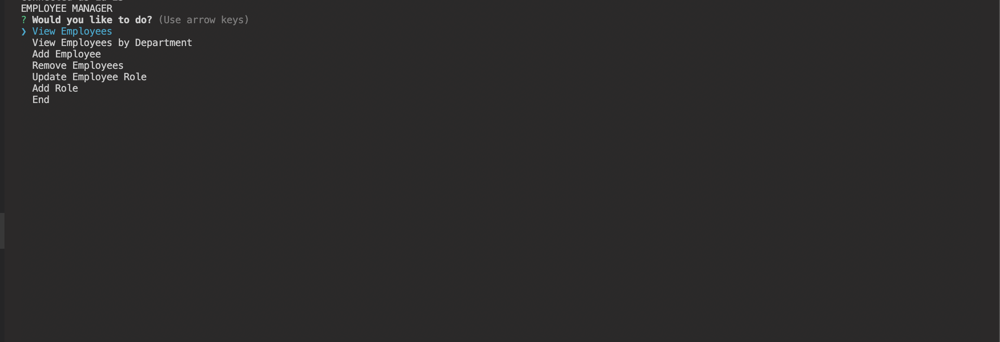

# Employee Tracker SQL

## Description
This employee tracker was built to solve problems with keeping employees organized in a database. Built with mysql it can update and add employees to a database along with view by certain departments.

## Usage
Clone the repo and open the terminal in server.js.
Run the following:
-npm i 
-run all schema files 
-npm i inquirer 
-npm i mysql  
-npm init -y 

## Built With
-Javascript 
-Node 
-MysQl 
-inquirer 

## ScreenShots

## License 
MIT License